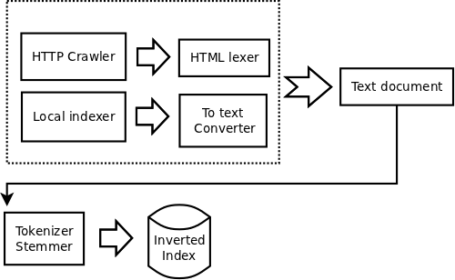

Intro
======

Mycelium is an open source information retrieval system or search engine.

It's programmed in C++ and Python. MongoDB is used for document storage. Some modules are exported as dynamic modules for Python usage with boost::python.

It's composed of several modules, the ones inside the dotted block retrieve documents from the web or the local filesystem, and they are converted to textual representation.

Then the tokenizer/stemmer module breaks the text in words or stems of words, which are then used to create an inverted index.

The basic scheme is retrieval -> conversion to text -> tokenization / stemming -> inverted index.

